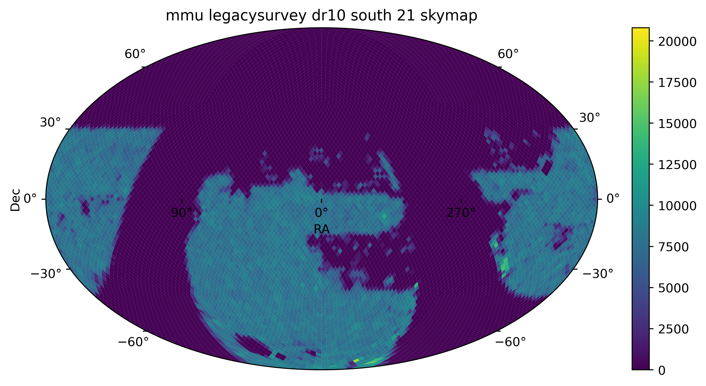

---
configs:
- config_name: default
  data_dir: mmu_legacysurvey_dr10_south_21/dataset
tags:
- astronomy
license: cc-by-4.0
pretty_name: mmu_legacysurvey_dr10_south_21
size_categories:
- 100M<n<1B
---

<div align="center">

</div>

# mmu_legacysurvey_dr10_south_21 HATS Catalog Collection

This is the collection of HATS catalogs representing mmu_legacysurvey_dr10_south_21.

This dataset is part of the [Multimodal Universe](https://github.com/MultimodalUniverse/MultimodalUniverse),
a large-scale collection of multimodal astronomical data. For full details, see the paper:
[The Multimodal Universe: Enabling Large-Scale Machine Learning with 100TBs of Astronomical Scientific Data](https://arxiv.org/abs/2412.02527).


### Access the catalog

We recommend the use of the [LSDB](https://lsdb.io) Python framework to access HATS catalogs.
LSDB can be installed via `pip install lsdb` or `conda install conda-forge::lsdb`,
see more details [in the docs](https://docs.lsdb.io/).
The following code provides a minimal example of opening this catalog:

```python
import lsdb

# Full sky coverage.
catalog = lsdb.open_catalog("https://huggingface.co/datasets/hugging-science/mmu_legacysurvey_dr10_south_21")
```

Each catalog in this collection is represented as a separate [Apache Parquet dataset](https://arrow.apache.org/docs/python/dataset.html) and can be accessed with a variety of tools, including `pandas`, `pyarrow`, `dask`, `Spark`, `DuckDB`.

### File structure

This catalog is represented by the following files and directories:

- [`collection.properties`](https://huggingface.co/datasets/hugging-science/mmu_legacysurvey_dr10_south_21/collection.properties) — textual metadata file describing the HATS collection of catalogs
- [`mmu_legacysurvey_dr10_south_21`](https://huggingface.co/datasets/hugging-science/mmu_legacysurvey_dr10_south_21/mmu_legacysurvey_dr10_south_21) — main HATS catalog directory
  - [`dataset/`](https://huggingface.co/datasets/hugging-science/mmu_legacysurvey_dr10_south_21/mmu_legacysurvey_dr10_south_21/dataset/) — Apache Parquet dataset directory for the main catalog
    - ... parquet metadata and data files in sub directories ...
  - [`hats.properties`](https://huggingface.co/datasets/hugging-science/mmu_legacysurvey_dr10_south_21/mmu_legacysurvey_dr10_south_21/hats.properties) — textual metadata file describing the main HATS catalog
  - [`partition_info.csv`](https://huggingface.co/datasets/hugging-science/mmu_legacysurvey_dr10_south_21/mmu_legacysurvey_dr10_south_21/partition_info.csv) — CSV file with a list of catalog HEALPix tiles (catalog partitions)
  - [`skymap.fits`](https://huggingface.co/datasets/hugging-science/mmu_legacysurvey_dr10_south_21/mmu_legacysurvey_dr10_south_21/skymap.fits) — HEALPix skymap FITS file with row-counts per HEALPix tile of fixed order 10
- [`mmu_legacysurvey_dr10_south_21_10arcs/`](https://huggingface.co/datasets/hugging-science/mmu_legacysurvey_dr10_south_21/mmu_legacysurvey_dr10_south_21_10arcs) — default margin catalog to ensure data completeness in cross-matching, the margin threshold is 10.0 arcseconds
  - ... margin catalog files and directories ...

### Catalog metadata

Metadata of the main HATS catalog, excluding margins and indexes:

| **Number of rows** | **Number of columns** | **Number of partitions** | **Size on disk** | **HATS Builder** |
| --- | --- | --- | --- | --- |
| 123,185,970 | 20 | 74,440 | 61.1 TiB | hats-import v0.7.3, hats v0.7.3 |


### Catalog columns

The main HATS catalog contains the following columns:

| **Name** |  **`_healpix_29`** | **`image.band`** | **`image.flux`** | **`image.mask`** | **`image.ivar`** | **`image.psf_fwhm`** | **`image.scale`** | **`blobmodel`** | **`rgb`** | **`object_mask`** | **`catalog.FLUX_G`** | **`catalog.FLUX_R`** | **`catalog.FLUX_I`** | **`catalog.FLUX_Z`** | **`catalog.TYPE`** | **`catalog.SHAPE_R`** | **`catalog.SHAPE_E1`** | **`catalog.SHAPE_E2`** | **`catalog.X`** | **`catalog.Y`** | **`EBV`** | **`FLUX_G`** | **`FLUX_R`** | **`FLUX_I`** | **`FLUX_Z`** | **`FLUX_W1`** | **`FLUX_W2`** | **`FLUX_W3`** | **`FLUX_W4`** | **`SHAPE_R`** | **`SHAPE_E1`** | **`SHAPE_E2`** | **`object_id`** | **`ra`** | **`dec`** |
| --- |  --- | --- | --- | --- | --- | --- | --- | --- | --- | --- | --- | --- | --- | --- | --- | --- | --- | --- | --- | --- | --- | --- | --- | --- | --- | --- | --- | --- | --- | --- | --- | --- | --- | --- | --- |
| **Data Type** |  int64 | list[string] | list[list<element: list<element: float>>] | list[list<element: list<element: bool>>] | list[list<element: list<element: float>>] | list[float] | list[float] | struct<bytes: binary, path: string> | struct<bytes: binary, path: string> | struct<bytes: binary, path: string> | list[float] | list[float] | list[float] | list[float] | list[float] | list[float] | list[float] | list[float] | list[float] | list[float] | float | float | float | float | float | float | float | float | float | float | float | float | string | double | double |
| **Nested?** |  — | image | image | image | image | image | image | — | — | — | catalog | catalog | catalog | catalog | catalog | catalog | catalog | catalog | catalog | catalog | — | — | — | — | — | — | — | — | — | — | — | — | — | — | — |


"Nested" indicates whether the column is stored as a nested field inside another "struct" column.


### Crossmatch with another catalog

HATS catalogs can be efficiently crossmatched using [LSDB](https://lsdb.io),
which leverages the HEALPix partitioning to avoid loading the full datasets into memory:

```python
import lsdb

mmu_legacysurvey_dr10_south_21 = lsdb.open_catalog("https://huggingface.co/datasets/hugging-science/mmu_legacysurvey_dr10_south_21")
other = lsdb.open_catalog("https://huggingface.co/datasets/<org>/<other_catalog>")

crossmatched = mmu_legacysurvey_dr10_south_21.crossmatch(other, radius_arcsec=1.0)
print(crossmatched)
```

See the [LSDB documentation](https://docs.lsdb.io/) for more details on crossmatching and other operations.

### Dataset-specific context

**Original survey**  
This dataset is based on the DESI Legacy Imaging Surveys Data Release 10 (DR10), specifically the 4-band imaging of the southern sky covering approximately 15,000 square degrees. The Legacy Surveys combine imaging observations from multiple telescopes and provide a large, uniformly processed dataset over a substantial fraction of the sky.

**Data modality**  
The dataset consists of 124 million image cutouts (160 × 160 pixels) in four optical bands (g, r, i, z) with a pixel scale of 0.262 arcsec. Each image is associated with measurements produced by the Legacy Survey analysis pipeline.

**Typical use cases**  
This specific dataset compilation is presented for the first time. Similar datasets based on Legacy Survey images have been used for machine learning applications such as identifying strong gravitational lenses and classifying galaxy morphologies.

**Caveats**  
The dataset includes only objects selected according to specific criteria, including object type, magnitude, availability of observations in all four bands, and quality flags. No further processing is applied beyond these selection cuts. As a result, image cutouts may contain problematic regions around the central object, which can be identified using the provided mask field.

**Citation**  
When using this dataset in scientific publications, users should include the official Legacy Surveys acknowledgment:  
https://www.legacysurvey.org/acknowledgment/#toc-entry-2